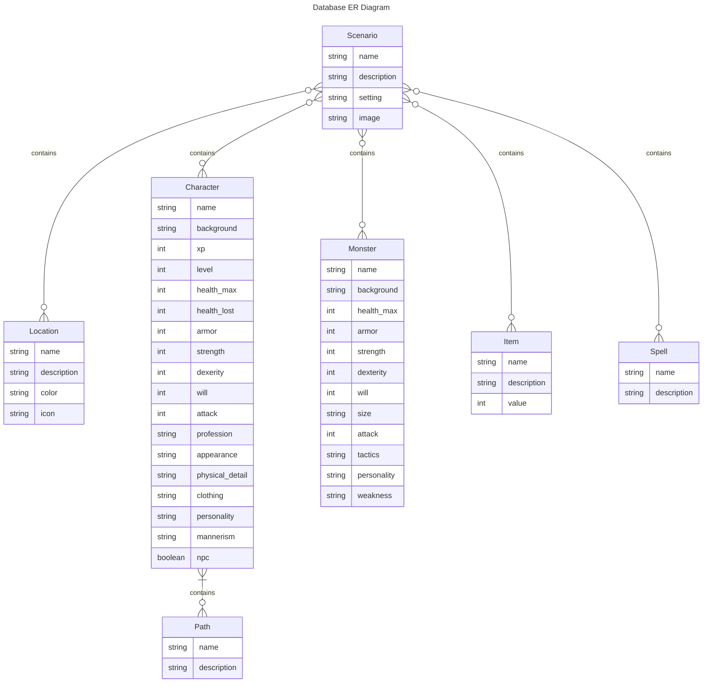
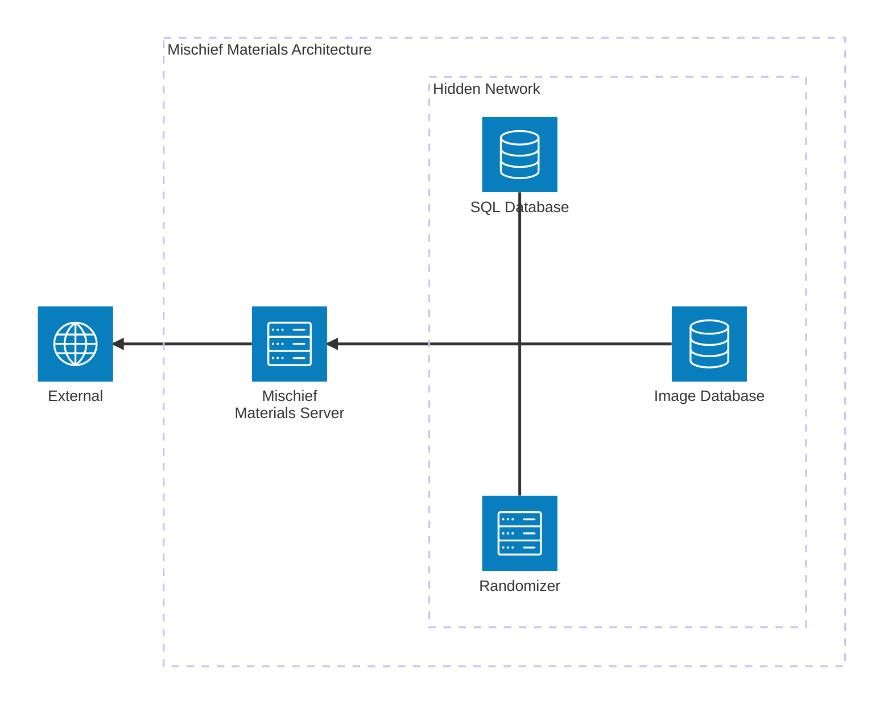

# Mischief Materials

This is a hobby web app created to assist with running sessions of the Tabletop Game Maze Rats

## Resources

To learn more about Next.js, take a look at the following resources:

- [Next.js Documentation](https://nextjs.org/docs) - learn about Next.js features and API.
- [Learn Next.js](https://nextjs.org/learn) - an interactive Next.js tutorial.

This project uses [`next/font`](https://nextjs.org/docs/basic-features/font-optimization) to automatically optimize and load a number of custom Google Fonts.

### UI Resources

- [Figma UI Mockup](https://www.figma.com/file/MoV25z5YXoqBKPIaHi4GRM/MRC-Layouts?type=design&node-id=0-1&mode=design&t=jBr15O7pjehRa1H7-0)
- [FontAwesome Free Icon Source](https://fontawesome.com/search)
- [Hero Free Icon Source](https://heroicons.com/)
- [Hero Free Pattern Source](https://heropatterns.com/)
- [CSS Flexbox Guide](https://css-tricks.com/snippets/css/a-guide-to-flexbox/)
- [Tailwind UI Resources](https://tailwindui.com/?ref=resources)
- [Tailwind Documentation](https://tailwindcss.com/docs/preflight)
- [Colour Generator](https://coolors.co/)
- [React API Reference](https://react.dev/reference/react)
- [Font Reference](https://developers.google.com/fonts/docs/css2)
- [Animation Reference](https://www.framer.com/motion/)

### Database Resources

- [Prisma API Reference](https://www.prisma.io/docs/reference/api-reference/prisma-schema-reference#default)
- [Prisma API Documentation](https://www.prisma.io/docs)

### Local Deployment

First, run the development server:

```bash
npm run dev
# or
yarn dev
# or
pnpm dev
```

Open [http://localhost:3000](http://localhost:3000) with your browser to see the result.

### Useful Commands

```bash
npx prisma studio # Opens prisma studio

npx prisma migrate dev # Updates database
```

### NPM Updating & Auditing

```bash
npm audit

npm outdated

npm prune

npm update

#major version
npm install $PACKAGE
```

## Diagrams
[Mermaid Entity Relationship Documentation](https://mermaid.js.org/syntax/entityRelationshipDiagram.html)

[Mermaid Architecture Documentation](https://mermaid.js.org/syntax/architecture.html)



## Architecture


